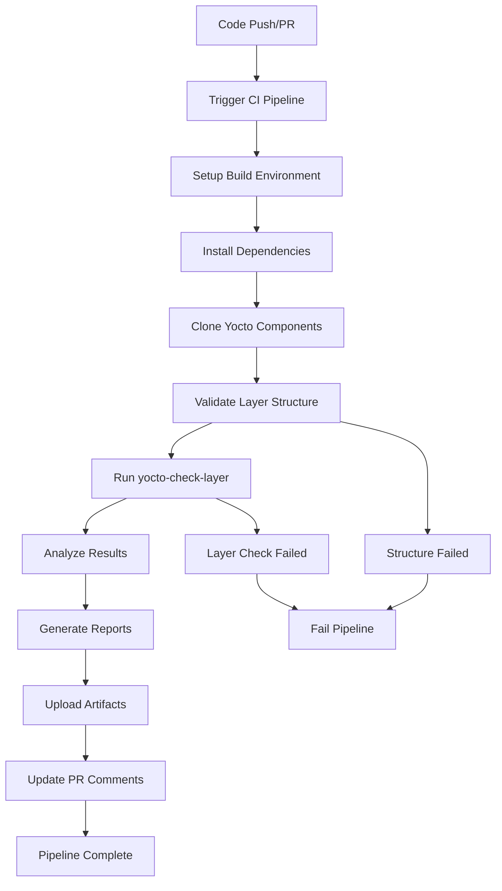

# CI/CD Pipeline Setup for Yocto Layer Validation

## Overview

This document describes the Continuous Integration/Continuous Deployment (CI/CD) pipeline implemented for validating that Dynamic Devices layers meet Yocto Project Compatible requirements and are ready for certification.

## Pipeline Components

### 1. GitHub Actions Workflow

**File**: `.github/workflows/yocto-layer-validation.yml`

The main CI/CD pipeline that automatically validates layers against Yocto Project Compatible requirements:

#### Features:
- **Multi-Version Testing**: Validates against multiple Yocto releases (scarthgap, kirkstone)
- **Multi-Layer Support**: Tests both BSP and distro layers independently
- **Automated Environment Setup**: Downloads and configures required Yocto components
- **Comprehensive Validation**: Runs structure checks and yocto-check-layer script
- **Artifact Collection**: Saves validation results and logs
- **PR Integration**: Comments on pull requests with validation results

#### Trigger Conditions:
- Push to `main` or `develop` branches
- Pull requests to `main` branch
- Weekly scheduled runs (Sundays at 2 AM UTC)
- Manual workflow dispatch with branch selection

#### Validation Matrix:
```yaml
strategy:
  matrix:
    yocto_branch: [scarthgap, kirkstone]
    layer: [meta-dynamicdevices-bsp, meta-dynamicdevices-distro]
```

### 2. Local Validation Scripts

**File**: `scripts/validation/validate-layers.sh`

Comprehensive local validation script for development and testing:

#### Usage:
```bash
# Validate all layers against scarthgap
./scripts/validation/validate-layers.sh --layer all --branch scarthgap

# Validate BSP layer only with verbose output
./scripts/validation/validate-layers.sh --layer bsp --verbose

# Clean environment and validate distro layer
./scripts/validation/validate-layers.sh --layer distro --clean
```

#### Features:
- **Flexible Layer Selection**: Validate individual layers or all layers
- **Multi-Branch Support**: Test against different Yocto releases
- **Environment Management**: Automatic setup and cleanup of validation environment
- **Detailed Reporting**: Generate comprehensive validation reports
- **Verbose Logging**: Optional detailed output for debugging

### 3. Pre-Commit Hook

**File**: `scripts/validation/pre-commit-hook.sh`

Git pre-commit hook for immediate validation of changes:

#### Features:
- **Fast Validation**: Quick structure and syntax checks
- **Change Detection**: Only validates modified layers
- **Recipe Validation**: Basic recipe syntax and requirement checks
- **Layer Separation**: Ensures proper BSP/distro separation
- **Required Files**: Validates presence of README, SECURITY, LICENSE files

#### Installation:
```bash
# Install pre-commit hook
ln -sf ../../scripts/validation/pre-commit-hook.sh .git/hooks/pre-commit

# Test pre-commit hook
./scripts/validation/pre-commit-hook.sh
```

## Validation Criteria

### Layer Structure Validation

1. **Required Files Check**:
   - `README.md` - Layer documentation
   - `SECURITY.md` - Security vulnerability reporting
   - `LICENSE` - Dual GPL-3.0/Commercial licensing
   - `conf/layer.conf` - Layer configuration

2. **Layer Configuration Validation**:
   - Required variables: `BBFILE_COLLECTIONS`, `BBFILE_PATTERN`, `BBFILE_PRIORITY`, `LAYERVERSION`
   - Proper dependencies: `LAYERDEPENDS`, `LAYERSERIES_COMPAT`
   - Valid priority values and syntax

3. **Layer Separation Compliance**:
   - **BSP Layer**: Hardware-only content, no distro configurations
   - **Distro Layer**: Distribution policy only, no machine configurations
   - **Application Layer**: Middleware and applications, proper dependencies

### yocto-check-layer Validation

The official Yocto Project validation script checks:

- Layer compatibility with OpenEmbedded-Core
- Recipe parsing and syntax validation
- Dependency resolution and conflicts
- Build system integration
- Best practices compliance

#### Correct Usage Syntax

The `yocto-check-layer` script requires specific command-line syntax:

```bash
# Basic usage - layer directory as positional argument
python3 scripts/yocto-check-layer LAYER_DIR

# With output log
python3 scripts/yocto-check-layer LAYER_DIR --output-log validation.log

# Disable automatic dependency checking
python3 scripts/yocto-check-layer LAYER_DIR --no-auto-dependency

# Multiple layers
python3 scripts/yocto-check-layer LAYER1_DIR LAYER2_DIR

# With additional dependencies
python3 scripts/yocto-check-layer LAYER_DIR --dependency DEP_LAYER_DIR

# Complete CI example
python3 ../build/layers/openembedded-core/scripts/yocto-check-layer \
  .. \
  --no-auto-dependency \
  --output-log ../layer-check.log
```

#### Common Syntax Errors to Avoid

❌ **Incorrect Usage:**
```bash
# Wrong: --layer flag doesn't exist
yocto-check-layer --layer LAYER_DIR

# Wrong: --no-auto-dependencies (plural) doesn't exist  
yocto-check-layer LAYER_DIR --no-auto-dependencies

# Wrong: Missing positional argument
yocto-check-layer --output-log validation.log
```

✅ **Correct Usage:**
```bash
# Correct: Layer directory as positional argument
yocto-check-layer LAYER_DIR

# Correct: --no-auto-dependency (singular)
yocto-check-layer LAYER_DIR --no-auto-dependency

# Correct: Layer path first, then options
yocto-check-layer LAYER_DIR --output-log validation.log
```

#### Available Arguments

- **Positional**: `LAYER_DIR` - Layer directory to check (required)
- `--output-log FILE` - File to output log (optional)
- `--dependency LAYER_DIR` - Additional layers to process for dependencies
- `--no-auto-dependency` - Disable automatic testing of dependencies
- `--machines MACHINE` - List of MACHINEs to use during testing
- `--additional-layers LAYER_DIR` - Additional layers to add during testing
- `--with-software-layer-signature-check` - Check software layer signatures (default)
- `--without-software-layer-signature-check` - Disable signature checking
- `--no-auto` - Disable auto layer discovery
- `--debug` - Enable debug output
- `--quiet` - Print only errors

### Multi-Version Compatibility

Testing against multiple Yocto releases ensures:

- **Forward Compatibility**: Layers work with newer Yocto versions
- **Backward Compatibility**: Support for LTS releases
- **Migration Path**: Clear upgrade path between versions

## CI/CD Pipeline Flow



## Environment Setup

### GitHub Actions Environment

The CI pipeline automatically sets up:

1. **Ubuntu 22.04 Runner** with required system packages
2. **Python 3** with BitBake dependencies
3. **Git repositories** for OpenEmbedded-Core, BitBake, meta-openembedded
4. **Build configuration** with minimal local.conf and bblayers.conf
5. **Caching** for downloads and sstate to improve performance

### Local Development Environment

For local validation:

1. **System Requirements**:
   - Ubuntu 20.04+ or compatible Linux distribution
   - Python 3.8+ with pip
   - Git 2.20+
   - Standard build tools (gcc, make, etc.)

2. **Setup Commands**:
   ```bash
   # Install system dependencies
   sudo apt-get install build-essential python3 python3-pip git
   
   # Run validation script (will setup Yocto environment)
   ./scripts/validation/validate-layers.sh --layer all
   ```

## Monitoring and Reporting

### CI Status Badges

All README files include status badges showing:

- **Layer Validation Status**: Real-time CI pipeline status
- **YP Compliance Ready**: Meets Yocto Project Compatible requirements (ready for certification)
- **Multi-Version Support**: Tested Yocto releases

### Validation Reports

Generated reports include:

1. **Structure Analysis**: Required files and configuration validation
2. **Layer Check Results**: Full yocto-check-layer output and analysis
3. **Multi-Version Summary**: Compatibility across Yocto releases
4. **Error Analysis**: Detailed error messages and resolution guidance

### Artifact Storage

CI pipeline stores:

- **Validation Logs**: Complete yocto-check-layer output
- **Build Configurations**: Generated local.conf and bblayers.conf
- **Reports**: Markdown reports with analysis and recommendations
- **Retention**: 30 days for validation logs, 90 days for reports

## Troubleshooting

### Common Issues

1. **BitBake Import Errors**:
   - Ensure proper PYTHONPATH setup
   - Verify BitBake version compatibility
   - Check Python dependencies

2. **Layer Dependency Failures**:
   - Validate LAYERDEPENDS settings
   - Ensure required layers are available
   - Check layer priority conflicts

3. **Recipe Parsing Errors**:
   - Validate recipe syntax
   - Check variable assignments
   - Verify file paths and includes

### Debug Commands

```bash
# Verbose validation with full output
./scripts/validation/validate-layers.sh --verbose --layer all

# Check specific layer configuration
python3 -c "
import sys
sys.path.insert(0, 'build/validation/layers/bitbake/lib')
import bb.parse
print('BitBake import successful')
"

# Manual yocto-check-layer execution
cd build/validation
python3 layers/openembedded-core/scripts/yocto-check-layer \
  ../../meta-dynamicdevices-bsp \
  --no-auto-dependency \
  --output-log manual-check.log
```

## Integration with Development Workflow

### Pre-Commit Validation

1. **Install Hook**: `ln -sf ../../scripts/validation/pre-commit-hook.sh .git/hooks/pre-commit`
2. **Automatic Validation**: Runs on every commit attempt
3. **Fast Feedback**: Quick validation without full environment setup

### Pull Request Workflow

1. **Automatic Triggering**: CI runs on all pull requests
2. **Status Checks**: Required for merge approval
3. **Comment Integration**: Results posted as PR comments
4. **Artifact Links**: Direct access to validation logs and reports

### Release Validation

1. **Scheduled Runs**: Weekly validation ensures ongoing compliance
2. **Multi-Version Testing**: Validates against supported Yocto releases
3. **Regression Detection**: Identifies compatibility issues early
4. **Release Readiness**: Confirms layers are ready for production use

## Best Practices

### Layer Development

1. **Incremental Validation**: Run local validation frequently during development
2. **Clean Environments**: Use `--clean` flag to ensure reproducible results
3. **Multi-Version Testing**: Test against all supported Yocto releases
4. **Documentation Updates**: Keep README and SECURITY files current

### CI/CD Maintenance

1. **Regular Updates**: Keep Yocto versions and dependencies current
2. **Cache Management**: Monitor cache effectiveness and cleanup policies
3. **Performance Optimization**: Optimize pipeline execution time
4. **Security Updates**: Keep runner images and dependencies updated

### Quality Assurance

1. **Comprehensive Testing**: Validate all layers and configurations
2. **Error Analysis**: Investigate and resolve all validation failures
3. **Documentation**: Maintain accurate and current documentation
4. **Community Standards**: Follow Yocto Project best practices and guidelines

## Future Enhancements

### Planned Improvements

1. **Performance Optimization**: Parallel validation execution
2. **Extended Testing**: Integration with actual build testing
3. **Security Scanning**: Automated vulnerability assessment
4. **Compliance Tracking**: Historical compliance trend analysis
5. **Integration Testing**: Cross-layer compatibility validation

### Community Integration

1. **OpenEmbedded Index**: Automated layer registration
2. **Yocto Project Compatible**: Submit for official certification once eligible
3. **Community Feedback**: Integration with Yocto Project tools and processes
4. **Best Practice Sharing**: Contribution to Yocto Project documentation

---

*This CI/CD pipeline ensures continuous validation that layers meet Yocto Project Compatible requirements and are ready for official certification, maintaining high-quality, interoperable layers for the Dynamic Devices ecosystem.*
